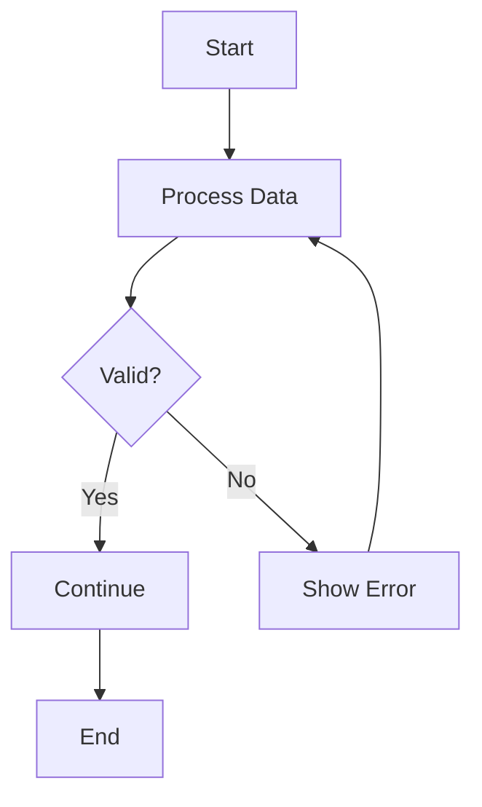
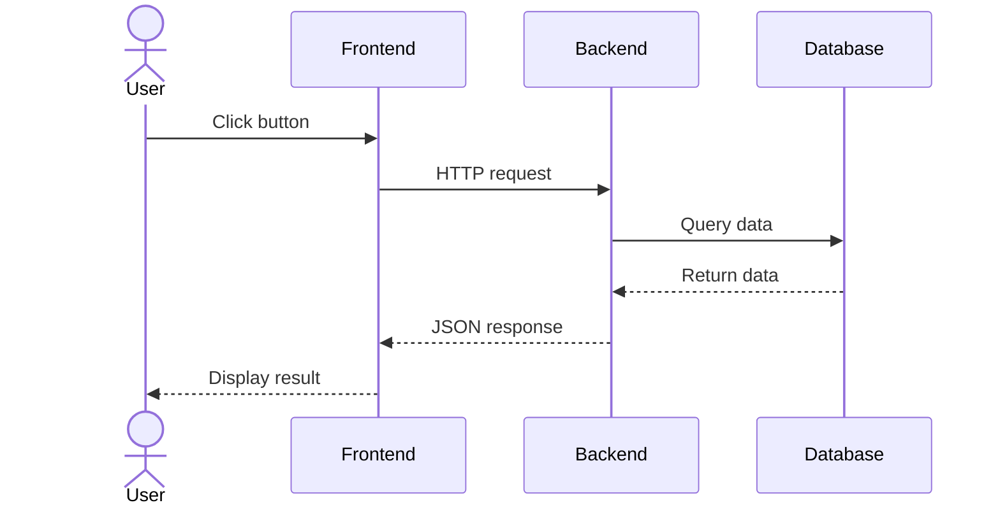
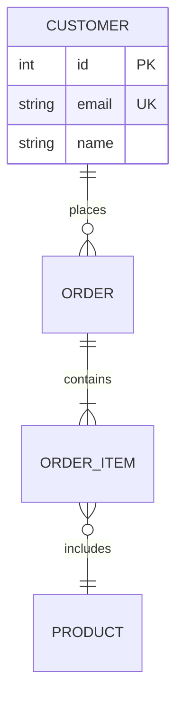
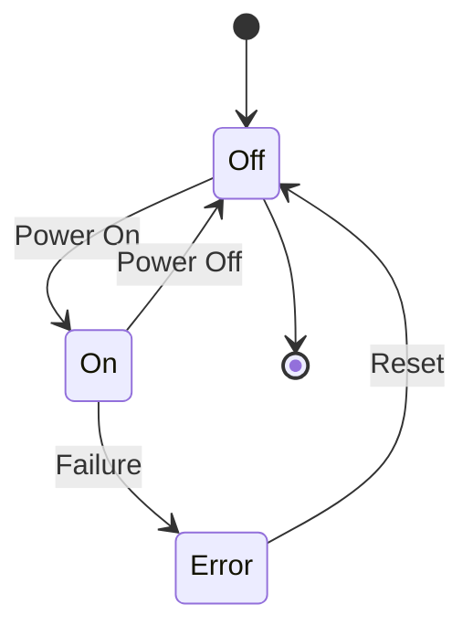
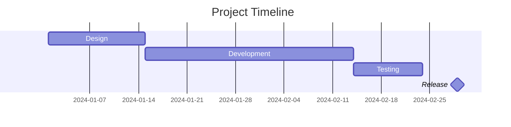
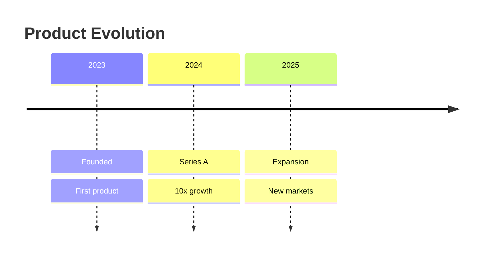
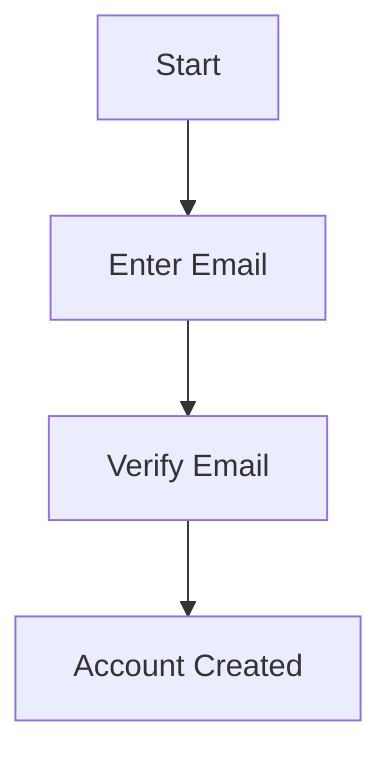
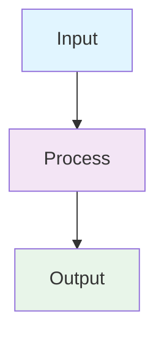
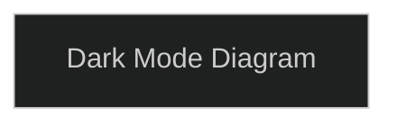

# Mermaid Diagram Skill

Create beautiful, production-quality diagrams using Mermaid syntax. Perfect for documenting systems, workflows, architectures, databases, and timelines. This skill helps you create clean, accessible diagrams that communicate complex concepts visually.

## Overview

Mermaid is a JavaScript-based diagramming and charting tool that uses a Markdown-like syntax. This makes it ideal for:
- **Documentation**: Add diagrams directly to markdown files
- **Architecture**: Visualize system design and infrastructure
- **Workflows**: Map processes and decision trees
- **Data Modeling**: Design databases and relationships
- **Project Planning**: Create timelines and dependencies
- **State Machines**: Document application states and transitions

For comprehensive syntax reference covering all 20+ diagram types, see [reference.md](reference.md).

## Common Diagram Types

### Flowchart (Process & Decision Trees)

Use for workflows, algorithms, and decision logic:



**When to use**: User workflows, API flows, business processes, error handling

### Sequence Diagram (Interactions & Messages)

Use for showing communication between systems or actors:



**When to use**: API calls, authentication flows, system interactions, message sequences

### Entity Relationship Diagram (Database Design)

Use for database schema and data relationships:



**When to use**: Database design, data modeling, relationship documentation

### State Diagram (State Machines)

Use for states and state transitions:



**When to use**: Application states, lifecycle diagrams, state management

### Gantt Chart (Project Planning)

Use for timelines, milestones, and dependencies:



**When to use**: Project scheduling, feature planning, release management

### Timeline (Chronological Events)

Use for historical events and timelines:



**When to use**: Company history, roadmaps, historical events

## Using Helper Scripts

This skill includes utility scripts in the `scripts/` directory:

### Validate Syntax

Before committing diagrams, validate syntax:

```bash
./scripts/validate.sh diagram.mmd
```

Returns exit code 0 if valid, 1 if syntax errors.

### Render to Images

Convert `.mmd` files to PNG, SVG, or PDF:

```bash
# Render to PNG with default theme
./scripts/render.sh diagram.mmd diagram.png

# Render with dark theme
./scripts/render.sh diagram.mmd diagram.png dark

# Render to SVG or PDF
./scripts/render.sh diagram.mmd diagram.svg
./scripts/render.sh diagram.mmd diagram.pdf
```

Themes: `default`, `dark`, `neutral`, `forest`, `base`

### Quick Preview

Generate a preview image quickly:

```bash
./scripts/preview.sh diagram.mmd
# Creates: diagram-preview.png
```

## Best Practices

### 1. Clarity & Simplicity

- Use descriptive labels for all nodes
- Keep diagrams focused on one concept
- Avoid over-cluttering with too many elements
- Break complex diagrams into smaller ones

### 2. Accessibility

Always include accessibility metadata:



### 3. Styling

Use consistent colors and styling for better readability:



### 4. Dark Mode Support

For dark mode environments, add theme configuration:



### 5. Performance

- Keep diagrams under 50-100 nodes for clarity
- Use subgraphs to organize large diagrams
- Avoid deeply nested structures

## When to Refer to Documentation

- **Basic examples**: See [examples.md](examples.md) for 15+ real-world scenarios
- **Complete syntax reference**: See [reference.md](reference.md) for all diagram types and advanced features
- **Specific diagram type**: Look up in reference.md's table of contents
- **Configuration & theming**: See reference.md section on Themes & Configuration
- **CLI usage**: See reference.md CLI Reference section

## Diagram Type Quick Reference

| Type | Best For | Complexity |
|------|----------|-----------|
| **Flowchart** | Processes, workflows, algorithms | Low |
| **Sequence** | API calls, interactions, message flows | Medium |
| **Class** | OOP design, inheritance, relationships | High |
| **State** | State machines, lifecycles | Medium |
| **ERD** | Database design, data relationships | Medium |
| **Gantt** | Project planning, timelines | Medium |
| **Timeline** | Chronological events, roadmaps | Low |
| **Git Graph** | Version control, branching | Low |
| **Mindmap** | Concept organization, brainstorming | Low |
| **Pie Chart** | Data distribution, percentages | Low |

For additional types (Sankey, C4, Quadrant, XY Charts, Radar, etc.), see [reference.md](reference.md).

## Common Questions

**Q: How do I add comments to a diagram?**
A: Use `%%` for comments: `%% This is a comment`

**Q: How do I make text bold or italic?**
A: Mermaid doesn't support markdown in labels. Use HTML in labels if needed: `["<b>Bold Text</b>"]`

**Q: Can I use custom colors?**
A: Yes, use style or class definitions with hex colors: `style A fill:#ff6b6b,stroke:#c92a2a`

**Q: How do I render diagrams to images?**
A: Use the included render.sh script: `./scripts/render.sh diagram.mmd output.png`

**Q: How do I validate diagram syntax?**
A: Use the included validate.sh script: `./scripts/validate.sh diagram.mmd`

## Advanced Resources

- **Official Documentation**: [Mermaid.js Docs](https://mermaid.js.org)
- **Interactive Editor**: [Mermaid Live Editor](https://mermaid.live)
- **Syntax Reference**: See [reference.md](reference.md) for comprehensive syntax documentation
- **Real-World Examples**: See [examples.md](examples.md) for practical use cases
