# Mermaid Examples: Real-World Scenarios

Practical examples of Mermaid diagrams for common use cases in software development, system design, and project management.

## Table of Contents

1. [System Architecture](#system-architecture)
2. [Microservices Architecture](#microservices-architecture)
3. [Authentication Flow](#authentication-flow)
4. [API Request-Response Sequence](#api-request-response-sequence)
5. [Database Design](#database-design)
6. [User Registration Process](#user-registration-process)
7. [Order Processing Workflow](#order-processing-workflow)
8. [Application State Machine](#application-state-machine)
9. [CI/CD Pipeline](#cicd-pipeline)
10. [Project Timeline](#project-timeline)
11. [Class Hierarchy - Design Patterns](#class-hierarchy---design-patterns)
12. [Git Workflow](#git-workflow)
13. [User Onboarding Journey](#user-onboarding-journey)
14. [Feature Dependency Graph](#feature-dependency-graph)
15. [Network Packet Structure](#network-packet-structure)

---

## System Architecture

**Use Case**: Documenting a three-tier web application architecture.

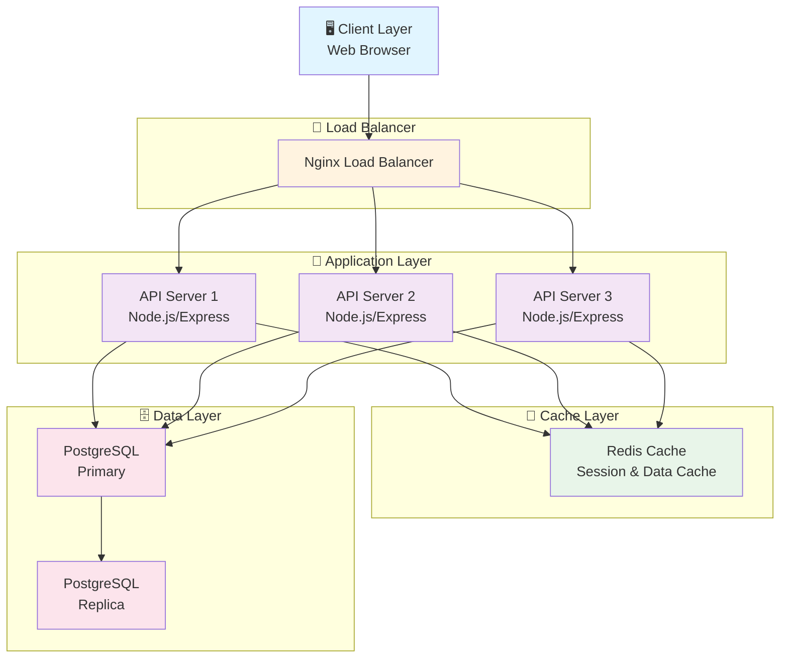

**When to Use**:
- Presenting infrastructure to stakeholders
- Documenting deployment architecture
- Planning scalability discussions

---

## Microservices Architecture

**Use Case**: Showing independent microservices and their communication patterns.

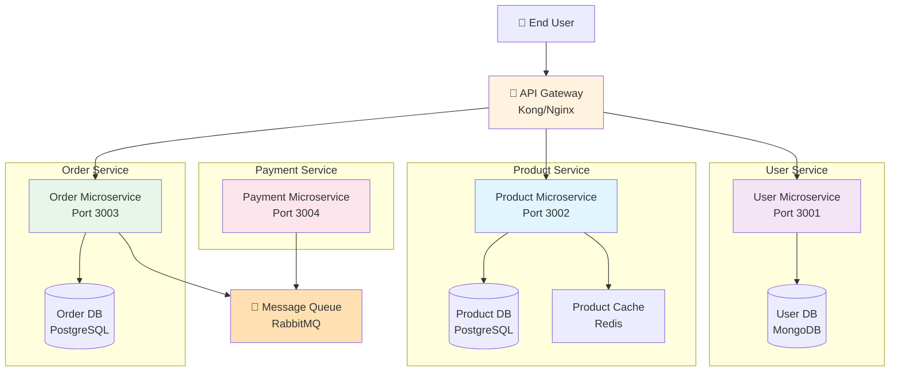

**When to Use**:
- Communicating microservices architecture
- Planning service boundaries
- Documenting inter-service communication

---

## Authentication Flow

**Use Case**: OAuth 2.0 authentication with third-party provider.

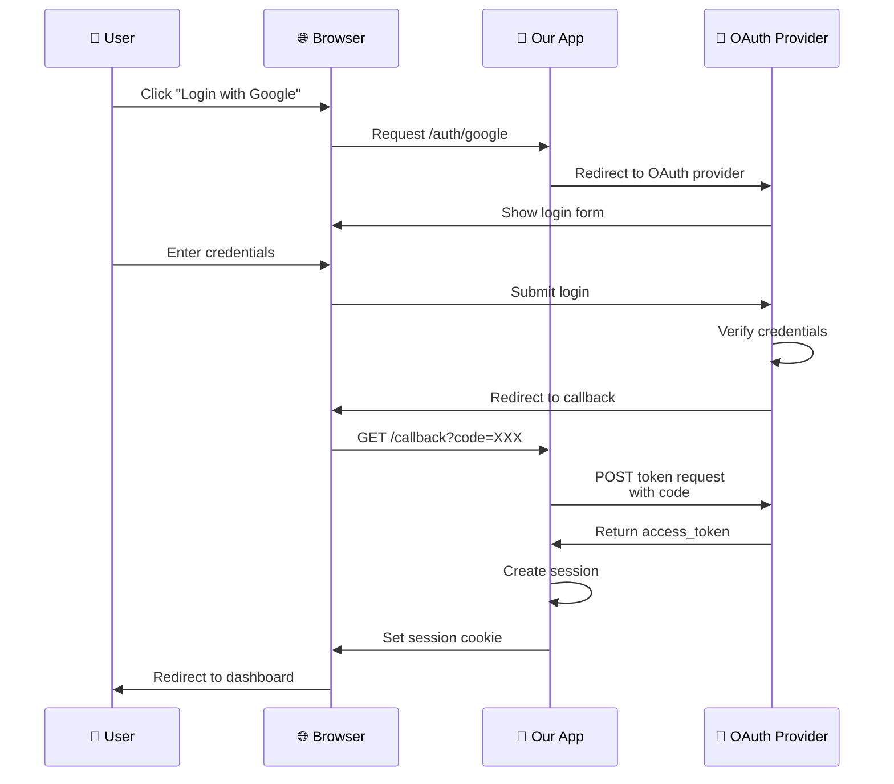

**When to Use**:
- Documenting authentication flows
- Explaining OAuth/SAML integration
- Planning security architecture

---

## API Request-Response Sequence

**Use Case**: Typical REST API interaction with error handling.

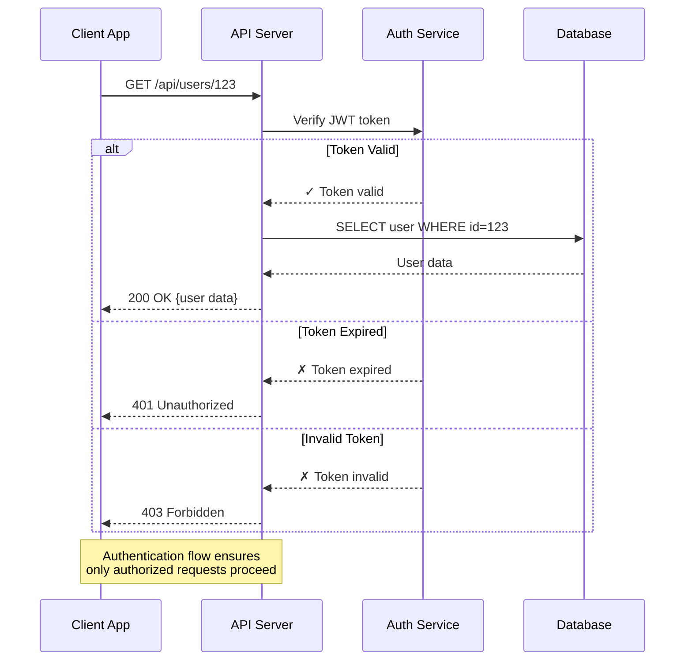

**When to Use**:
- Documenting API specifications
- Explaining error handling
- Planning error recovery

---

## Database Design

**Use Case**: E-commerce database schema.

```mermaid
erDiagram
    CUSTOMER ||--o{ ORDER : places
    CUSTOMER ||--o{ REVIEW : writes
    ORDER ||--|{ ORDER_ITEM : contains
    ORDER_ITEM }o--|| PRODUCT : includes
    PRODUCT ||--o{ REVIEW : receives
    PRODUCT }o--|| CATEGORY : "belongs to"
    CATEGORY ||--o{ PRODUCT : contains
    PRODUCT ||--o{ INVENTORY : tracks
    ORDER ||--o{ PAYMENT : receives
    ORDER ||--o{ SHIPMENT : has

    CUSTOMER {
        int id PK
        string email UK "Unique"
        string password_hash
        string first_name
        string last_name
        text address
        string phone
        datetime created_at
        datetime updated_at
    }

    PRODUCT {
        int id PK
        string name
        text description
        float price
        int stock_quantity
        int category_id FK
        datetime created_at
    }

    ORDER {
        int id PK
        int customer_id FK
        float total_amount
        string status
        datetime order_date
        datetime shipped_date
    }

    ORDER_ITEM {
        int id PK
        int order_id FK
        int product_id FK
        int quantity
        float unit_price
    }

    CATEGORY {
        int id PK
        string name UK
        text description
    }

    INVENTORY {
        int id PK
        int product_id FK UK
        int quantity_available
        int quantity_reserved
        datetime last_updated
    }

    PAYMENT {
        int id PK
        int order_id FK
        float amount
        string method
        string status
        datetime processed_at
    }

    SHIPMENT {
        int id PK
        int order_id FK
        string carrier
        string tracking_number
        datetime shipped_date
        datetime delivered_date
    }

    REVIEW {
        int id PK
        int customer_id FK
        int product_id FK
        int rating
        text comment
        datetime created_at
    }
```

**When to Use**:
- Database schema documentation
- Planning database migrations
- Explaining data relationships

---

## User Registration Process

**Use Case**: Complete user registration workflow with validation.

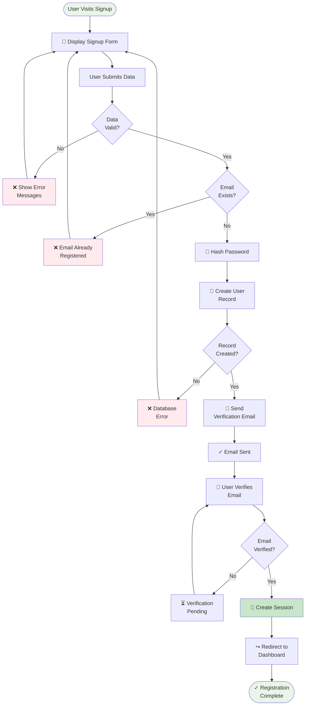

**When to Use**:
- Documenting onboarding flows
- Planning error handling
- Communicating business logic

---

## Order Processing Workflow

**Use Case**: Order fulfillment state machine.

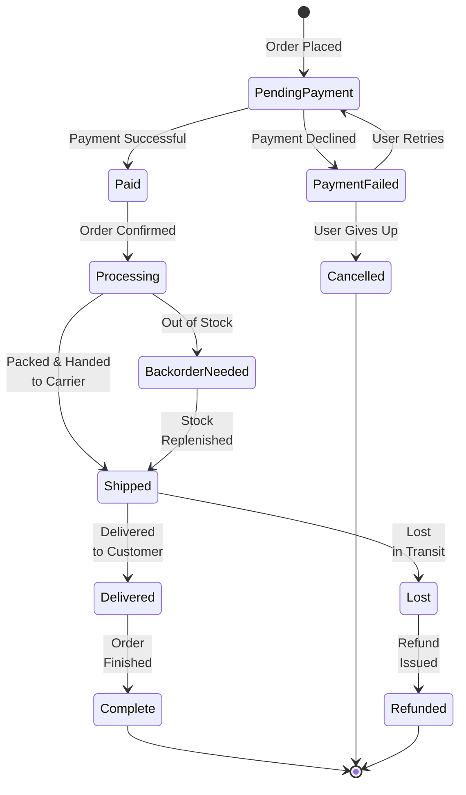

**When to Use**:
- Documenting order fulfillment
- Planning state transitions
- Handling business edge cases

---

## Application State Machine

**Use Case**: Multi-step wizard or form state management.

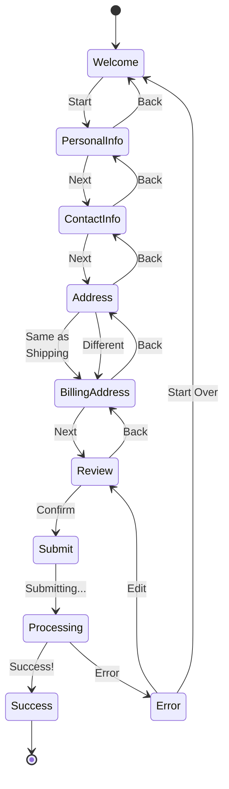

**When to Use**:
- Managing complex form workflows
- Planning multi-step processes
- Documenting state transitions

---

## CI/CD Pipeline

**Use Case**: Automated deployment pipeline.

```mermaid
graph LR
    Commit["📝 Developer<br/>Commits Code"]
    Build["🔨 Build<br/>Application"]
    Test["🧪 Run Tests"]
    Lint["✓ Code Quality<br/>Check"]
    DockerBuild["🐳 Build Docker<br/>Image"]
    Registry["📦 Push to<br/>Registry"]
    StageDeploy["🚀 Deploy<br/>to Staging"]
    StageTest["🧪 Smoke Tests<br/>on Staging"]
    Approval["👤 Manual<br/>Approval"]
    ProdDeploy["🚀 Deploy<br/>to Production"]
    Monitor["📊 Monitor<br/>Health"]

    Commit --> Build
    Build --> Test
    Test --> Lint

    Lint -->|Pass| DockerBuild
    Lint -->|Fail| Failure["❌ Pipeline<br/>Failed"]

    DockerBuild --> Registry
    Registry --> StageDeploy
    StageDeploy --> StageTest

    StageTest -->|Fail| Failure
    StageTest -->|Pass| Approval

    Approval -->|Approved| ProdDeploy
    Approval -->|Rejected| End["⏹️ Stopped"]

    ProdDeploy --> Monitor
    Monitor -->|Healthy| Success["✓ Deployment<br/>Complete"]
    Monitor -->|Issues| Rollback["↶ Rollback"]
    Rollback --> Success

    style Commit fill:#e1f5fe
    style Success fill:#e8f5e9
    style Failure fill:#ffebee
    style Approval fill:#fff3e0
```

**When to Use**:
- Documenting deployment processes
- Planning automation strategies
- Communicating release procedures

---

## Project Timeline

**Use Case**: Software project phases and milestones.

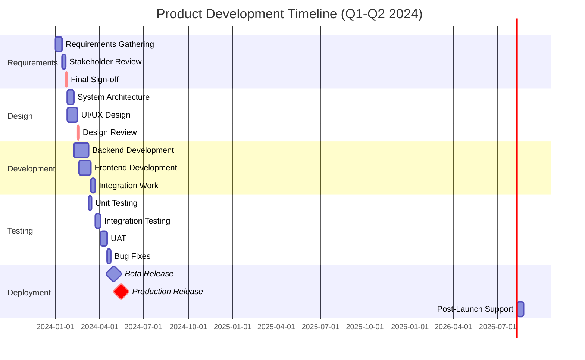

**When to Use**:
- Planning project timelines
- Tracking milestones
- Communicating schedules to stakeholders

---

## Class Hierarchy - Design Patterns

**Use Case**: Factory pattern implementation.

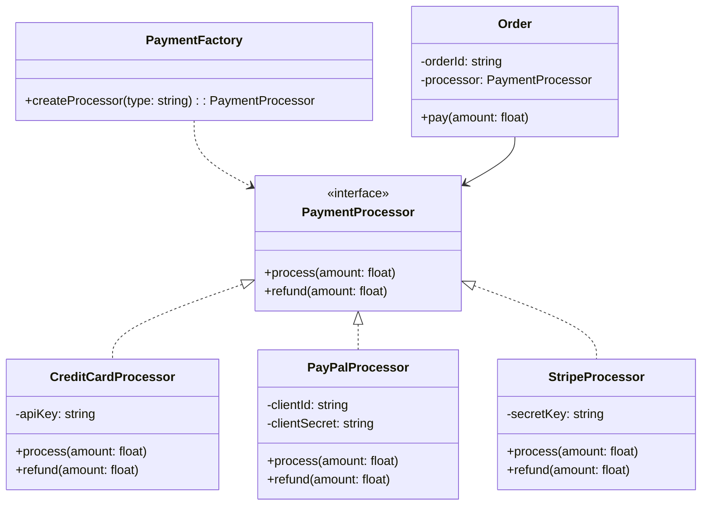

**When to Use**:
- Documenting design patterns
- Explaining class relationships
- Planning refactoring

---

## Git Workflow

**Use Case**: Feature branch Git workflow (simplified).

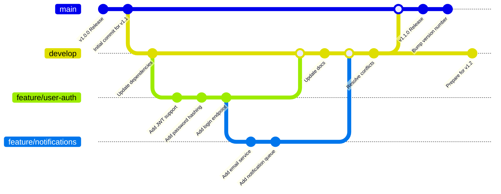

**When to Use**:
- Documenting branching strategy
- Explaining Git workflows to team
- Planning release processes

---

## User Onboarding Journey

**Use Case**: SaaS product onboarding experience.

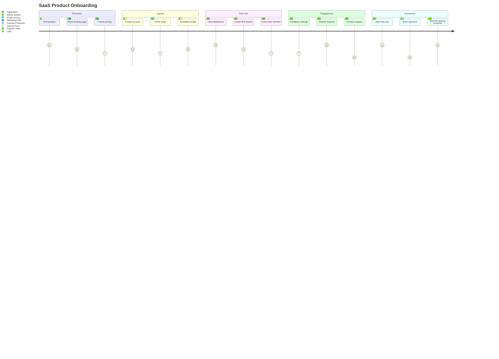

**When to Use**:
- Planning product onboarding
- Documenting user experience
- Identifying friction points

---

## Feature Dependency Graph

**Use Case**: Planning feature releases with dependencies.

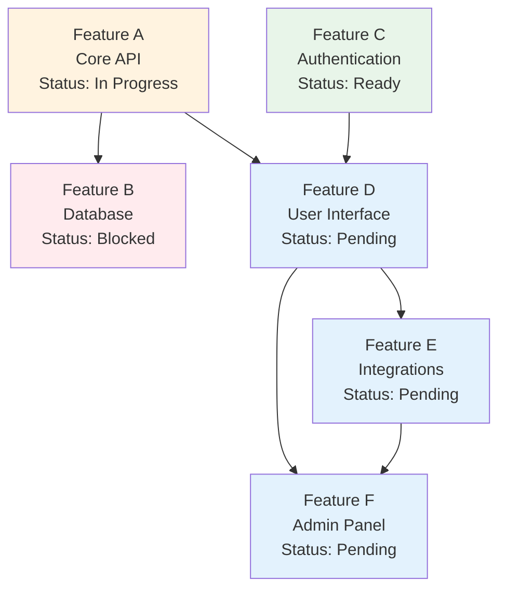

**When to Use**:
- Planning release schedules
- Identifying blockers
- Communicating dependencies

---

## Network Packet Structure

**Use Case**: IPv4 header format documentation.

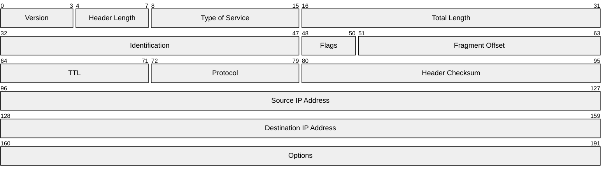

**When to Use**:
- Documenting network protocols
- Teaching binary data structures
- Explaining packet formats

---

## Quick Reference by Use Case

| Use Case | Diagram Type | File |
|----------|-------------|------|
| Process workflows | Flowchart | `.mmd` |
| API interactions | Sequence Diagram | `.mmd` |
| Database schema | Entity Relationship | `.mmd` |
| State management | State Diagram | `.mmd` |
| Architecture overview | Graph/Flowchart | `.mmd` |
| Timeline planning | Gantt Chart | `.mmd` |
| Team responsibilities | Class Diagram | `.mmd` |
| System context | C4 Diagram | `.mmd` |
| Data distribution | Pie Chart | `.mmd` |
| Feature priority | Quadrant Chart | `.mmd` |
| Performance metrics | Radar Chart | `.mmd` |

