# Mermaid Comprehensive Reference

Complete technical reference for Mermaid diagram syntax, covering all 20+ diagram types, configuration options, theming, and advanced features.

## Table of Contents

1. [Flowcharts](#flowcharts)
2. [Sequence Diagrams](#sequence-diagrams)
3. [Class Diagrams](#class-diagrams)
4. [State Diagrams](#state-diagrams)
5. [Entity Relationship Diagrams](#entity-relationship-diagrams)
6. [Gantt Charts](#gantt-charts)
7. [Timeline Diagrams](#timeline-diagrams)
8. [Git Graphs](#git-graphs)
9. [User Journey](#user-journey)
10. [Pie Charts](#pie-charts)
11. [Mindmaps](#mindmaps)
12. [Requirement Diagrams](#requirement-diagrams)
13. [Sankey Diagrams](#sankey-diagrams)
14. [C4 Diagrams](#c4-diagrams)
15. [Quadrant Charts](#quadrant-charts)
16. [XY Charts](#xy-charts)
17. [Block Diagrams](#block-diagrams)
18. [Packet Diagrams](#packet-diagrams)
19. [Architecture Diagrams](#architecture-diagrams)
20. [Kanban Boards](#kanban-boards)
21. [Radar Charts](#radar-charts)
22. [Themes & Configuration](#themes--configuration)
23. [Advanced Features](#advanced-features)
24. [CLI Reference](#cli-reference)

---

## Flowcharts

Flowcharts represent processes, workflows, and decision trees with connected nodes.

### Direction Keywords

- `TD` or `TB`: Top-Down (Top-to-Bottom)
- `BT`: Bottom-to-Top
- `LR`: Left-to-Right
- `RL`: Right-to-Left

### Node Shapes

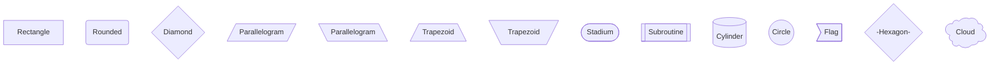

### Connection Types

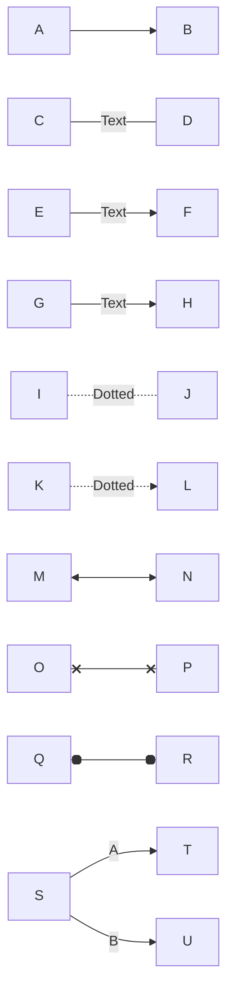

### Subgraphs

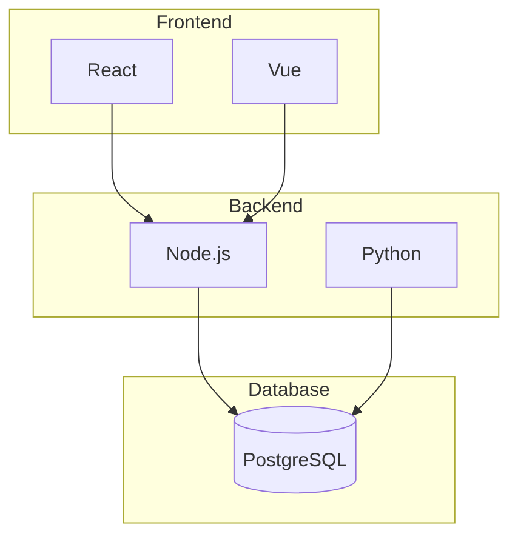

### Styling

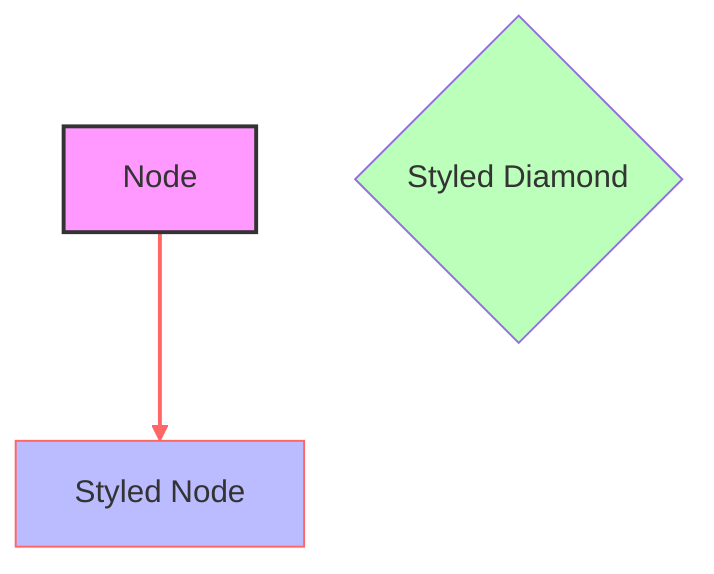

### Comments

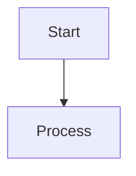

---

## Sequence Diagrams

Sequence diagrams show interactions between actors/participants over time.

### Actors and Messages

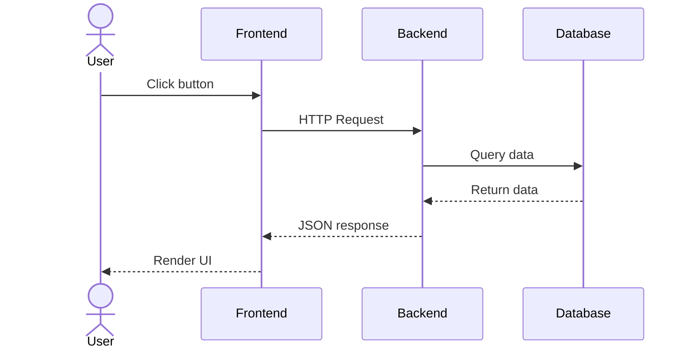

### Message Types

- `->`: Solid line without arrow
- `-->`: Dotted line without arrow
- `->>`: Solid line with arrow
- `-->>`: Dotted line with arrow
- `-x`: Solid line with cross
- `--x`: Dotted line with cross
- `-) `: Solid line to actor (open right)
- `--) `: Dotted line to actor (open right)
- `(- `: Solid line from actor (open left)
- `(-- `: Dotted line from actor (open left)

### Notes

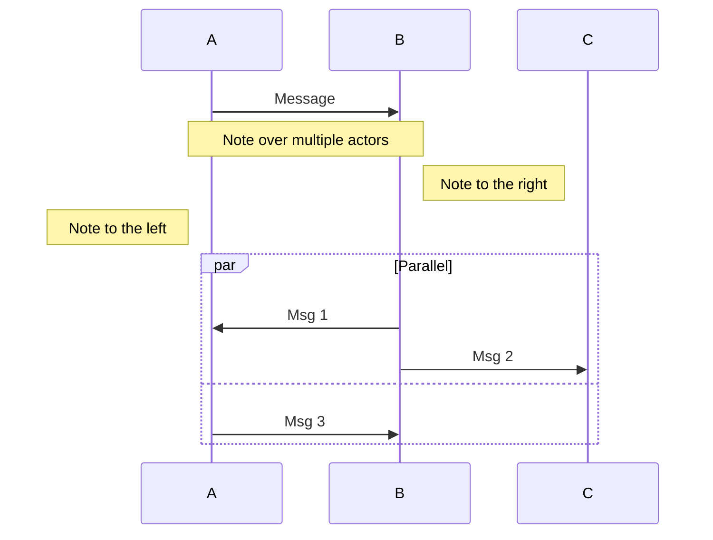

### Alt/Else Logic

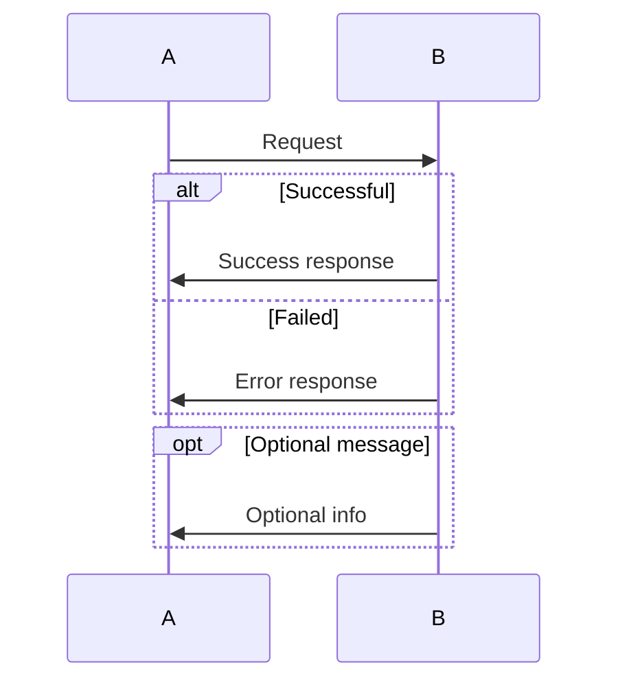

### Loops and Breaks

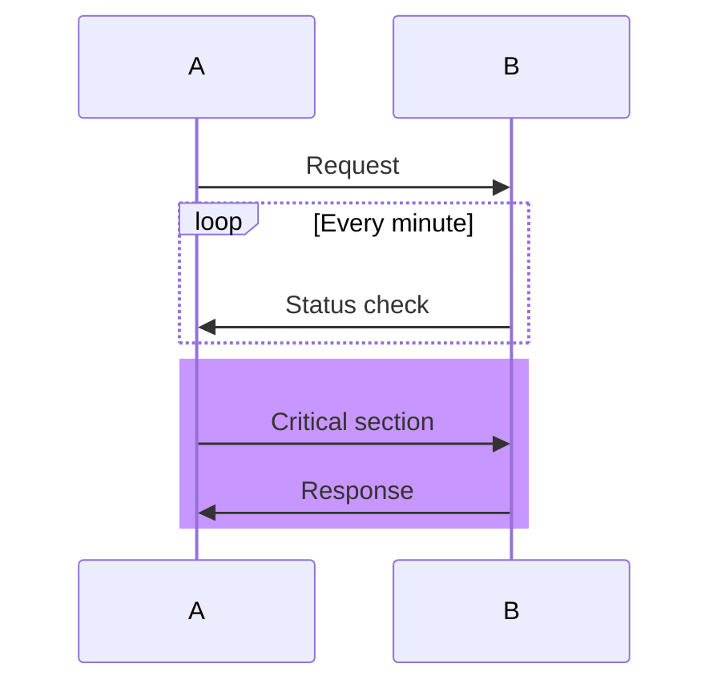

---

## Class Diagrams

Class diagrams show object-oriented structure, inheritance, and relationships.

### Class Definition

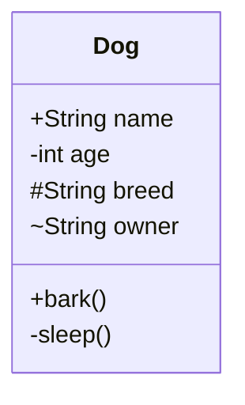

### Visibility Modifiers

- `+`: Public
- `-`: Private
- `#`: Protected
- `~`: Package

### Relationships

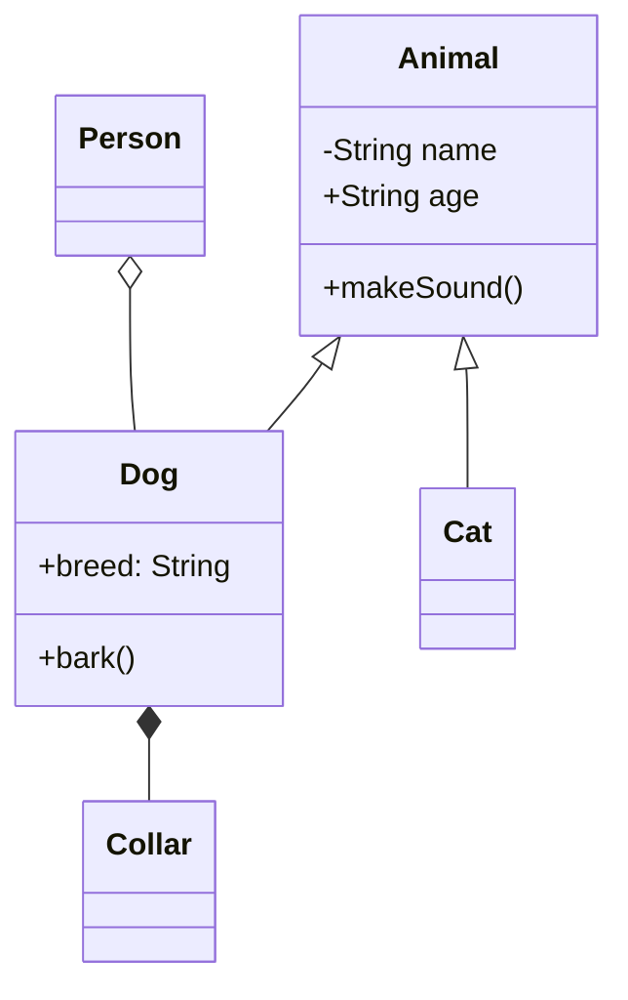

### Relationship Types

- `<|--`: Inheritance
- `*--`: Composition
- `o--`: Aggregation
- `-->`: Association
- `..>`: Dependency
- `..`: Realization

### Advanced

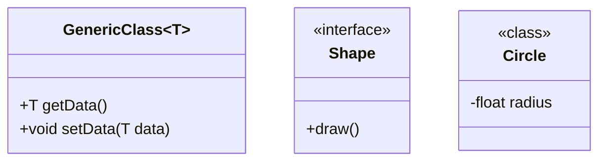

---

## State Diagrams

State diagrams show states and transitions in a system.

### Basic States

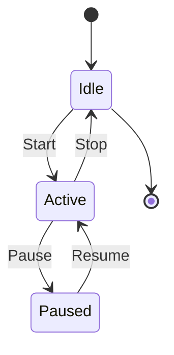

### Composite States

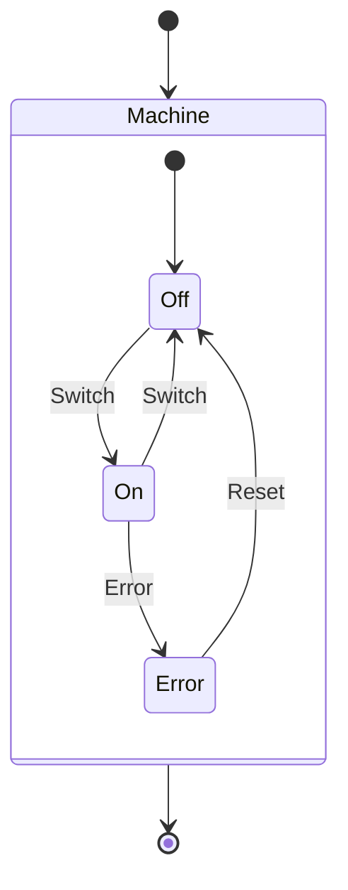

### Internal Transitions

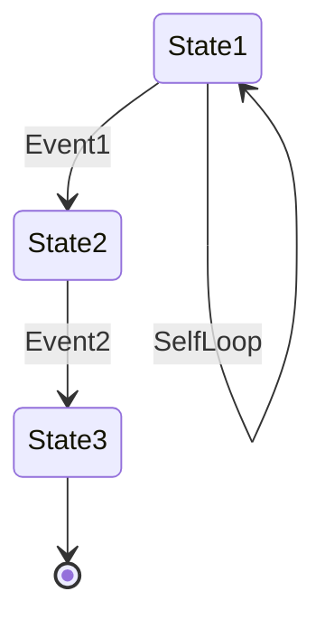

### Fork and Join

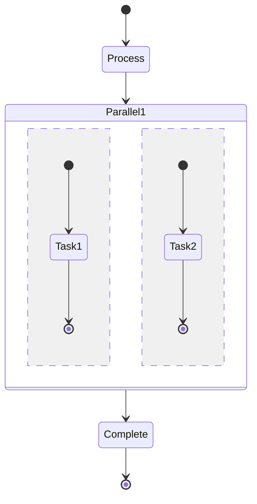

---

## Entity Relationship Diagrams

ERD shows entities and their relationships.

### Basic Entities and Relationships

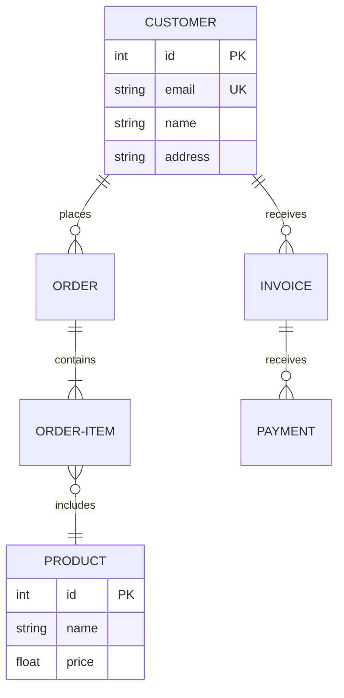

### Relationship Cardinality

- `|o`: Zero or one
- `||`: One and only one
- `o{`: Zero or more
- `|{`: One or more

### Attributes

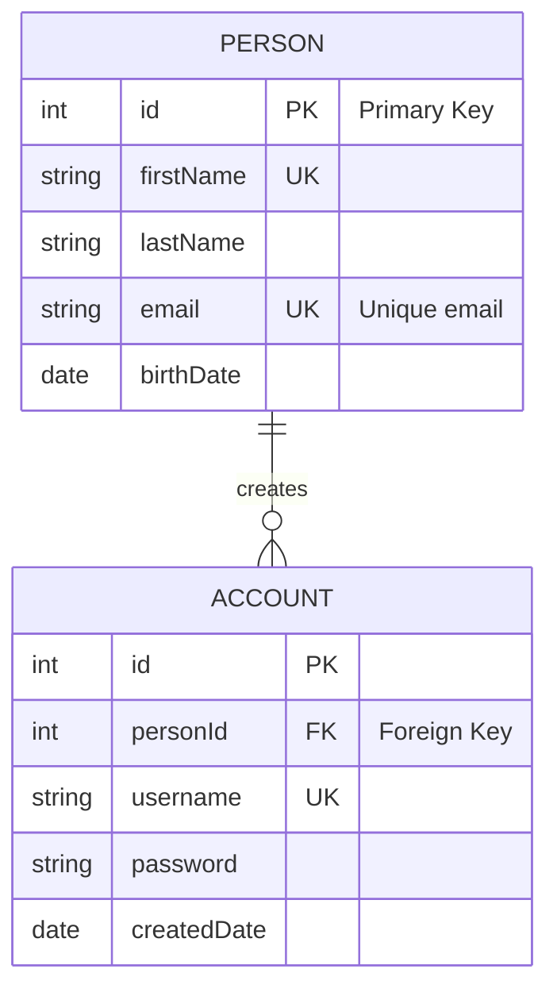

---

## Gantt Charts

Gantt charts show project timelines and task dependencies.

### Basic Tasks

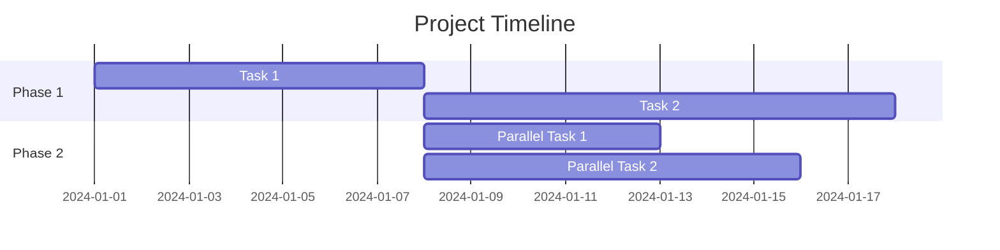

### Task Types and Dependencies

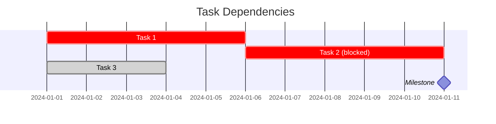

### Sections and Milestones

```mermaid
gantt
    title Complex Project
    dateFormat YYYY-MM-DD

    section Design
    Wireframes       :des1, 2024-01-01, 5d
    Design review    :des2, after des1, 3d

    section Development
    Frontend         :dev1, after des2, 10d
    Backend          :dev2, after des2, 12d
    Integration      :dev3, after dev1 dev2, 5d

    section Testing
    QA Testing       :qa1, after dev3, 7d
    UAT              :qa2, after qa1, 5d

    Release          :milestone, 2024-02-29, 0d
```

---

## Timeline Diagrams

Timeline diagrams show chronological events.

### Basic Timeline

```mermaid
timeline
    title Project Timeline
    2024-01 : Q1 Planning
    2024-02 : Design Phase
    2024-03 : Development Starts
    2024-04 : Beta Release
    2024-05 : GA Release
```

### Multi-level Timeline

```mermaid
timeline
    title Company History
    2020 : Founded company : Early products
    2021 : Series A funding : Product expansion
    2022 : Series B funding : Team growth : Office expansion
    2023 : 100M users : IPO preparation
    2024 : Global expansion : New markets
```

---

## Git Graphs

Git graphs show version control branching and merging.

### Basic Git Flow

```mermaid
gitGraph
    commit id: "Initial commit"
    commit id: "Feature development"
    branch develop
    checkout develop
    commit id: "Dev work"
    commit id: "More features"
    checkout main
    merge develop
    commit id: "Release v1.0"
```

### Multiple Branches

```mermaid
gitGraph
    commit id: "v0.1"
    branch develop
    checkout main
    branch hotfix
    checkout hotfix
    commit id: "Fix bug"
    checkout main
    merge hotfix
    commit id: "v0.1.1"
    checkout develop
    commit id: "New feature"
    checkout main
    merge develop
    commit id: "v0.2"
```

---

## User Journey

User journey diagrams show user interactions with a system.

### Basic Journey

```mermaid
journey
    title Shopping Journey
    section Discovery
      Discover product: 5: User, System
      Read reviews: 4: User
      Check price: 5: User, System
    section Purchase
      Add to cart: 4: User, System
      Checkout: 3: User, System
      Payment: 2: User, System
    section Post-Purchase
      Receive confirmation: 5: System
      Track shipment: 4: User, System
      Receive product: 5: User, System
```

### Sections and Scores

- Scores 0-5 indicate satisfaction level
- Sections group related activities
- Can include tasks/activities and actors

---

## Pie Charts

Pie charts show data distribution.

### Basic Pie Chart

```mermaid
pie title Market Share
    "Product A" : 40
    "Product B" : 35
    "Product C" : 20
    "Product D" : 5
```

### Labeled Pie Chart

```mermaid
pie title Browser Usage
    "Chrome" : 65
    "Firefox" : 15
    "Safari" : 12
    "Edge" : 8
```

---

## Mindmaps

Mindmaps organize concepts hierarchically.

### Basic Mindmap

```mermaid
mindmap
    root((Project Planning))
        Resources
            Team
            Budget
            Tools
        Timeline
            Phase 1
            Phase 2
            Phase 3
        Deliverables
            Documentation
            Code
            Tests
```

---

## Requirement Diagrams

Requirement diagrams show system requirements and relationships.

### Basic Requirements

```mermaid
requirementDiagram
    requirement system_auth {
        id: 1
        text: System must authenticate users
        risk: high
        verifymethod: test
    }

    requirement password_strength {
        id: 2
        text: Passwords must be 8+ characters
        risk: high
        verifymethod: inspection
    }

    system_auth - contains : password_strength
```

---

## Sankey Diagrams

Sankey diagrams show flows and their relative magnitudes.

### Basic Sankey

```mermaid
sankey-beta
    Traffic,Google,100
    Traffic,Direct,80
    Traffic,Social,50
    Google,Desktop,80
    Google,Mobile,20
    Direct,Desktop,50
    Direct,Mobile,30
```

---

## C4 Diagrams

C4 diagrams show system context and architecture at different levels.

### System Context

```mermaid
C4Context
    title System Context Diagram
    Person(User, "End User", "A user of the system")
    System(System, "Our System", "Does something")
    SystemDb(ExtSystem, "External System", "Provides data")

    Rel(User, System, "Uses")
    Rel(System, ExtSystem, "Queries")
```

### Container Diagram

```mermaid
C4Container
    title Container Diagram

    Container(Web, "Web App", "React SPA")
    Container(API, "API Server", "Node.js/Express")
    Container(DB, "Database", "PostgreSQL")
    Container(Cache, "Cache", "Redis")

    Rel(Web, API, "Uses")
    Rel(API, DB, "Queries")
    Rel(API, Cache, "Caches")
```

---

## Quadrant Charts

Quadrant charts show relationships between two variables.

### Basic Quadrant

```mermaid
quadrantChart
    title Feature Priority Matrix
    x-axis Low --> High
    y-axis Low --> High

    Urgent & Important: 0.9, 0.8
    Important: 0.7, 0.6
    Urgent: 0.8, 0.3
    Nice to Have: 0.3, 0.2
```

---

## XY Charts

XY charts show scatter, line, and bar data.

### Scatter Plot

```mermaid
xychart-beta
    title Correlation Chart
    x-axis [1, 2, 3, 4, 5, 6]
    y-axis "Values" 1 --> 10
    line [1, 2, 3, 4, 5, 6]
    scatter [1, 3, 2, 5, 4, 6]
```

### Line Chart

```mermaid
xychart-beta
    title Sales Trend
    x-axis [Jan, Feb, Mar, Apr, May, Jun]
    y-axis "Sales" 0 --> 100
    line [10, 20, 35, 50, 65, 75]
    bar [5, 15, 30, 45, 60, 70]
```

---

## Block Diagrams

Block diagrams show system components and connections.

### Basic Blocks

```mermaid
block-beta
    columns 3
    A["Input"]
    B["Process"]
    C["Output"]
    A --> B --> C
```

---

## Packet Diagrams

Packet diagrams show network packet structure.

### Basic Packet

```mermaid
packet-beta
    0-7: "Version"
    8-15: "Header Length"
    16-31: "Total Length"
    32-47: "Identification"
    48-63: "Flags, Fragment Offset"
    64-79: "TTL"
    80-95: "Protocol"
```

---

## Architecture Diagrams

Architecture diagrams using various notations.

### Simple Architecture

```mermaid
graph TB
    Client[Client Application]
    LoadBalancer[Load Balancer]
    API1[API Server 1]
    API2[API Server 2]
    Cache[Redis Cache]
    DB[(Database)]

    Client --> LoadBalancer
    LoadBalancer --> API1
    LoadBalancer --> API2
    API1 --> Cache
    API2 --> Cache
    API1 --> DB
    API2 --> DB
```

---

## Kanban Boards

Kanban boards show work items across columns.

### Basic Kanban

```mermaid
block-beta
    columns 4
    space
    space
    space
    space
    A["Todo"]
    B["In Progress"]
    C["In Review"]
    D["Done"]
    space
    space
    space
    space
    E["Task 1"]
    F["Task 2"]
    G["Task 3"]
    H["Task 4"]
```

---

## Radar Charts

Radar charts show multi-variable comparison.

### Basic Radar

```mermaid
radar
    title Developer Skills Assessment
    ax: Coding, Testing, Architecture, Communication, Leadership, Documentation

    Backend Developer: 90, 75, 70, 60, 40, 65
    Frontend Developer: 85, 80, 65, 75, 50, 70
    Full-Stack Developer: 80, 75, 75, 70, 60, 75
```

---

## Themes & Configuration

### Built-in Themes

```mermaid
%%{init: {'theme': 'default'}}%%
flowchart TD
    A[Default Theme]
```

Available themes:
- `default`: Light theme (default)
- `dark`: Dark theme
- `neutral`: Neutral/grey theme
- `forest`: Green-based theme
- `base`: Base theme without styling

### Configuration Options

```mermaid
%%{init: {
    'theme': 'dark',
    'flowchart': {
        'useMaxWidth': true,
        'htmlLabels': true,
        'curve': 'linear'
    },
    'primaryColor': '#ff6b6b',
    'primaryBorderColor': '#c92a2a'
}%%
flowchart TD
    A[Configured] --> B[Node]
```

### Common Config Options

- `theme`: Theme name
- `logLevel`: 'debug', 'info', 'warn', 'error', 'fatal'
- `securityLevel`: 'strict', 'loose', 'antiscript'
- `startOnLoad`: true/false
- `diagramMarginX`: margin in pixels
- `diagramMarginY`: margin in pixels
- `htmlLabels`: true/false for HTML in labels

### Flowchart-Specific Config

```mermaid
%%{init: {
    'flowchart': {
        'curve': 'basis',
        'nodeSpacing': 50,
        'rankSpacing': 50,
        'useMaxWidth': true,
        'harrowLength': 5,
        'layoutDirection': 'LR'
    }
}%%
```

### Sequence Diagram Config

```mermaid
%%{init: {
    'sequence': {
        'mirrorActors': true,
        'showSequenceNumbers': true,
        'actorFontSize': 16,
        'messageFontSize': 16
    }
}%%
```

---

## Advanced Features

### Accessibility

Every diagram should include:

```mermaid
%%{init: {
    'accessibilityLevel': 'functional',
    'accTitle': 'System Architecture Diagram',
    'accDescr': 'Shows frontend, backend, and database components with interactions'
}%%
flowchart TD
    A[Frontend]
    B[Backend]
    C[Database]
    A --> B --> C
```

### Comments

```mermaid
flowchart TD
    %% This is a comment
    A[Start] %% inline comment
    %% Multiple comments can be used
    A --> B[End]
```

### Styling with Classes

```mermaid
flowchart TD
    A[Node A]
    B[Node B]
    C[Node C]

    A --> B --> C

    classDef important fill:#f9f,stroke:#333,stroke-width:2px
    classDef success fill:#bfb,stroke:#333

    class A important
    class C success
```

### External Link Click Handlers

```mermaid
flowchart TD
    A[Click me]
    B[Regular node]

    A --> B

    click A "https://example.com"
    click B "https://docs.example.com" "Open docs"
```

### Tooltips

```mermaid
flowchart TD
    A[Hover for info]
    B[Another node]

    A --> B

    click A callback "Tooltip text"
```

---

## CLI Reference

### mmdc (Mermaid CLI)

Location: `/opt/homebrew/bin/mmdc`

#### Basic Rendering

```bash
mmdc -i diagram.mmd -o diagram.png
mmdc -i diagram.mmd -o diagram.svg
mmdc -i diagram.mmd -o diagram.pdf
```

#### With Theme

```bash
mmdc -i diagram.mmd -o diagram.png -t dark
mmdc -i diagram.mmd -o diagram.png -t forest
mmdc -i diagram.mmd -o diagram.png -t neutral
```

#### Transparent Background

```bash
mmdc -i diagram.mmd -o diagram.png -b transparent
```

#### With Width/Height

```bash
mmdc -i diagram.mmd -o diagram.png --width 800
mmdc -i diagram.mmd -o diagram.png --scale 2
```

#### Configuration

```bash
mmdc -i diagram.mmd -o diagram.png -c config.json
```

Configuration file (config.json):
```json
{
    "theme": "dark",
    "logLevel": "info",
    "securityLevel": "loose"
}
```

#### Batch Processing

```bash
for file in *.mmd; do
    mmdc -i "$file" -o "${file%.mmd}.png"
done
```

---

## Best Practices

1. **Accessibility**: Always include `accTitle` and `accDescr` for screen reader support
2. **Performance**: Keep diagrams focused - split complex diagrams into multiple simpler ones
3. **Clarity**: Use descriptive labels and consistent terminology
4. **Styling**: Limit color palettes for accessibility (consider colorblind users)
5. **Theming**: Use dark theme config for dark-mode documentation
6. **Whitespace**: Avoid cluttered layouts - let the diagram breathe
7. **Comments**: Use comments to explain non-obvious diagram decisions
8. **Testing**: Validate syntax before committing (use validate.sh)
9. **Version Control**: Store .mmd files in git for tracking changes
10. **Documentation**: Add context around diagrams explaining what they show

---

## Diagram Type Quick Reference

| Type | Best For | Complexity |
|------|----------|-----------|
| Flowchart | Processes, decision trees, workflows | Low |
| Sequence | Interactions, message flows, API calls | Medium |
| Class | OOP structures, inheritance, relationships | High |
| State | State machines, lifecycle diagrams | Medium |
| ERD | Database design, data relationships | Medium |
| Gantt | Project planning, timelines, dependencies | Medium |
| Timeline | Chronological events, history | Low |
| Git Graph | Version control, branching | Low |
| User Journey | User flows, experience maps | Medium |
| Pie Chart | Data distribution, percentages | Low |
| Mindmap | Concept organization, brainstorming | Low |
| Sankey | Flow/magnitude visualization | Medium |
| C4 | System architecture at levels | High |
| Quadrant | 2D variable comparison, prioritization | Low |
| XY Chart | Statistical data, trends | Low |
| Radar | Multi-variable comparison | Medium |

